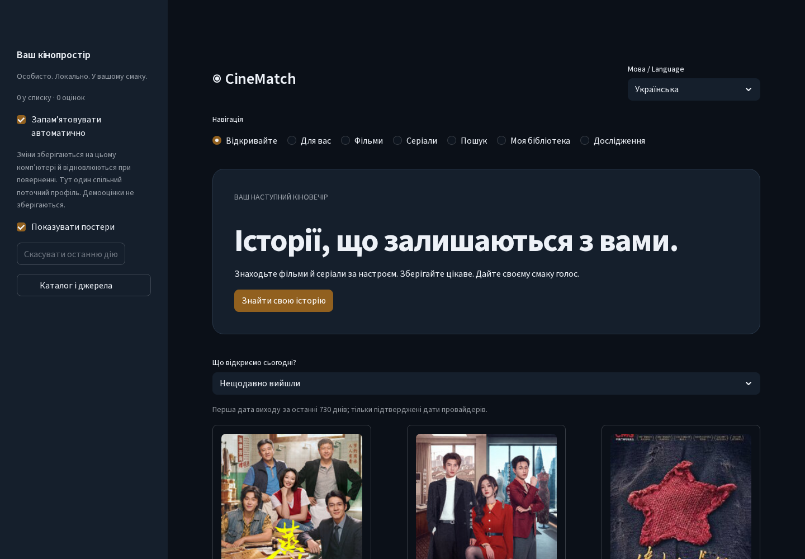
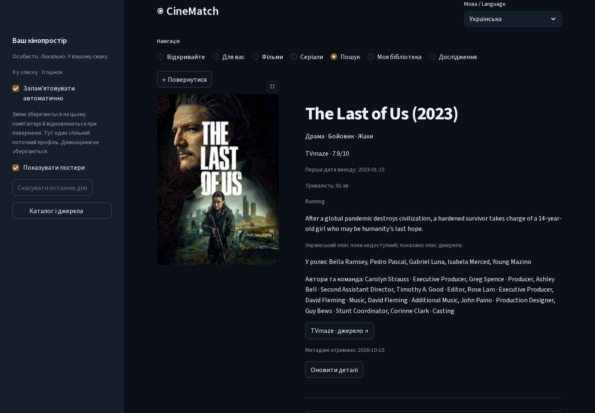

# ◉ CineMatch

[](https://github.com/Bandoof/CineMatch/actions/workflows/ci.yml)

[](LICENSE)

**Stories that stay with you. / Історії, що залишаються з вами.**

CineMatch v1.3 is a local, bilingual movie and series discovery application:
cinematic dark cards, Ukrainian/English title search, useful details, personal
recommendations and a library that stays on your computer. Built with Python,
Streamlit, NumPy, Pandas and SQLite. CPU-first; no account, GPU, LLM or paid API
is required. Modern movie metadata optionally uses a TMDB developer token.

[Українська інструкція](Почати.md) · [Architecture](docs/architecture.md) ·
[Provider terms/configuration](docs/catalog-providers.md) · [v1.3 verification](docs/release-v13.md)



Screenshots show the running local application with public MovieLens/TVmaze data.
Library screenshots use deliberate QA actions in an isolated test profile;
they are not an owner's viewing history. Artwork belongs to its providers and
rights holders. Older screenshots are [historical documentation](docs/classic-guide.md).

## Start locally / Швидкий старт

Use Python 3.10 or 3.11. On Windows use `.venv\Scripts\Activate.ps1` in place of
activation below, or invoke `.venv\Scripts\python.exe` directly.

```bash
python -m venv .venv
source .venv/bin/activate
python -m pip install -r requirements.txt
python -m scripts.sync_catalog --directory data/discovery --pages 1
python -m streamlit run app/streamlit_app.py --server.address=127.0.0.1
```

Open [CineMatch locally](http://127.0.0.1:8501). This starts with real TVmaze metadata,
without a training dataset. A fresh offline checkout has no bundled catalog:
the useful empty page offers an explicit refresh or provider search. Once a
snapshot is saved, names, search, details and library work offline; remote posters
need internet, or turn off **Show posters**.

For historical films and the existing seven recommendation algorithms:

```bash
python -m scripts.download_data
python -m scripts.download_movies
python -m scripts.train
```

These download official MovieLens 100K and latest-small **development** data and
train local numerical artifacts. They are not a new scientific holdout. The app
can fit a missing local full-data model at first startup; this takes longer and
does not replace committed weights or benchmark reports.
Optional historical Wikidata/Wikipedia metadata: `python -m scripts.download_metadata`.
This is an explicit, resumable network job; a full catalog involves many requests.

## Discover, search, save

- **Discover:** verified recent/upcoming dates, historical MovieLens popularity,
  transparent hidden gems, genre similarity and verified short-runtime movies.
  Historical votes are never called current trends.
- **For You:** familiar-title onboarding, original Adaptive ranking for known
  titles, and separately disclosed genre/source-quality discovery for new titles.
- **Movies / TV Series / Search:** exact, partial, original/localized, typo,
  transliteration and mixed-language retrieval; media, genre, year and source-rating
  filters, stable sorts and 12-card pagination.
- **Details:** actual synopsis, names, dates, genres, rating source, available
  cast/crew/runtime/status, source links and official trailers when verified.
  Missing Ukrainian text falls back to English/original source metadata.
- **My Library:** watchlist, watched, stars, not-interested, session snooze and
  actual changes in this session. Filter, sort, Undo, JSON backup and named profiles.
  Opening details never marks a title watched.
- **Research:** existing algorithms, explanations and historical evidence are
  accessible away from everyday discovery controls.



Ukrainian is the default UI language. Search matches both languages in either UI.
Translation coverage depends on the sources: TVmaze is primarily original/English;
TMDB localized responses are optional. We do not generate translations or ratings.

## Modern catalog and attribution

TVmaze needs no key; metadata is **CC BY-SA**, with source links and ShareAlike
obligations. Optional TMDB provides movies, localized metadata and recent/upcoming
lists. Set `TMDB_READ_ACCESS_TOKEN` in the local process environment, then explicitly
refresh/search. Never put a real token in Git, screenshots or exports. TMDB developer
usage follows current noncommercial terms; commercial use needs separate permission.
The approved logo and required notice appear when TMDB data is used:

> This product uses the TMDB API but is not endorsed or certified by TMDB.

MIT covers code, not provider metadata, trademarks or artwork. See the
[provider guide](docs/catalog-providers.md) for official terms, bounded caches,
expiration, image rules, identity mapping and optional configuration.

Measured public QA setup (2026-10-10): **10,123 canonical historical films + 973
TVmaze series = 11,096 titles**, including 32 series first released in 2023 or
later, 968 series synopses and 971 series poster links. Five TVmaze index pages
plus the day's web schedule and explicit title search were used. This is a partial
snapshot, not every release. The earlier documented installation had 602 series;
overlap with that old local snapshot was not measured. **No TMDB token was available
for live QA:** contemporary movie feeds are implemented and contract-tested, but
live movie coverage is not claimed here.

Training observations and modern metadata are separate. MovieLens, TVmaze and
TMDB movie/series IDs have distinct namespaces. Only unique IMDb/type/year or
established provider identity maps them; ambiguous remakes stay separate.
New metadata never fabricates collaborative training interactions.

## Privacy, profiles and offline behavior

SQLite autosave retains revision protection against stale sessions. This is **one
installation's shared current profile**, not authenticated multiuser storage.
Ratings and library stay local. Only an explicit provider search sends its query;
background profile-based API calls are not made.

Legacy JSON and schemas 2–5 still import. Exports stay schema 5 unless modern IDs
require schema 6, whose minimal references restore titles without a metadata cache.
Imports validate before changing state; corrupt files and storage errors preserve
existing data. Keep backups when rolling back: older versions cannot read schema 6.

`CINEMATCH_PROFILE_DB` selects a separate local DB; `CINEMATCH_AUTOSAVE=0` disables
automatic memory and `CINEMATCH_LOCAL_PROFILES=0` disables local profile controls.
`CINEMATCH_DISCOVERY_DIR` selects the modern snapshot/cache.
`CINEMATCH_UI=classic` retains the previous interface; use a separate profile DB
when your normal profile contains modern IDs. [UI/rollback guide](docs/product-ui.md).

## Recommendation engineering and evidence

The seven existing algorithms—Adaptive, Semantic TF-IDF/LSA, Hybrid, Collaborative
ALS, Item-KNN, signed genre content and Popularity—are preserved. Numerical fixture
outputs remain equivalent. Modern cold titles use disclosed genre affinity and
actual provider quality, without collaborative histories or calibrated predictions.

The historical **+17.8% Adaptive claim remains unverified**. Saved v1.2 evidence has
disjoint 171-user validation and 326-user test cohorts, but selection/final outcomes
are missing and the final cohort is already consumed. No new holdout was run.
Historical v3 target overlap remains disclosed; old reports/datasets are preserved.
[Recovery evidence](reports/ml_v12.md) · [Research limits](docs/ml-v12-research.md) ·
[Model card](docs/ml-v3-model-card.md).

## Verification and limitations

The [v1.3 report](docs/release-v13.md) records executed tests, Linux/Windows CI,
security checks, real desktop/mobile Chromium flows and measured latency.
Synthetic engineering timings are not Windows performance or ML quality.
Tests require no catalog/API download; optional CPU encoder/browser checks have
explicit setup. Remote artwork can fail offline. TMDB live behavior still needs
credentialed QA. Native Streamlit supports keyboard controls/mobile stacking;
this is not complete screen-reader or broad browser certification.
No public hosting, accounts, cloud sync, GitHub Release or automatic merge occurred.

[Development](docs/development.md) · [Contributing](CONTRIBUTING.md) ·
[Security](SECURITY.md) · [Changelog](CHANGELOG.md) · [Classic guide](docs/classic-guide.md)
