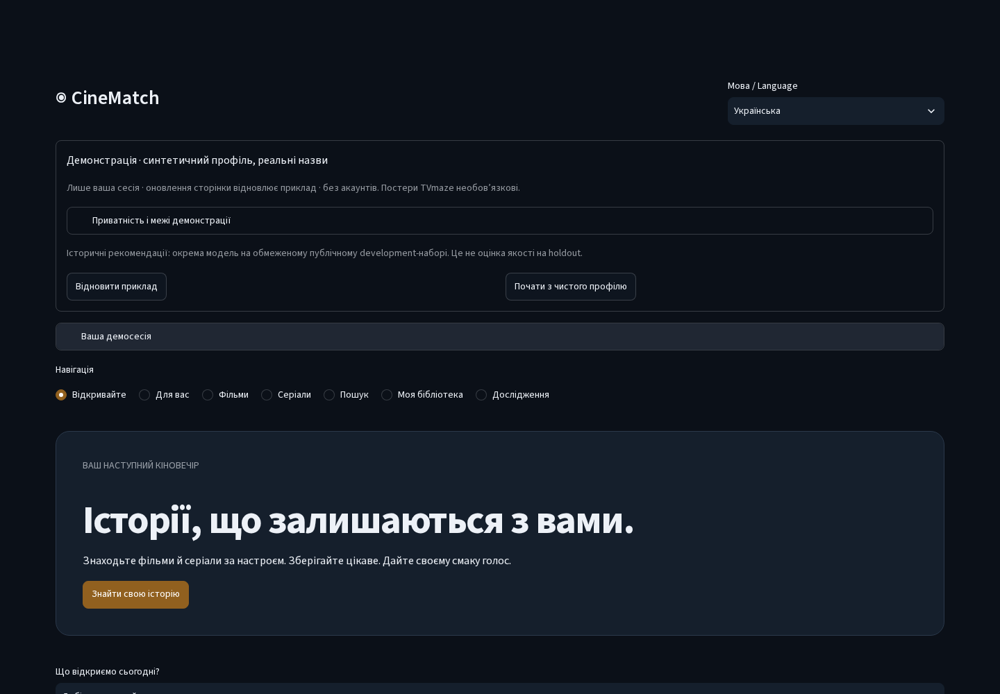
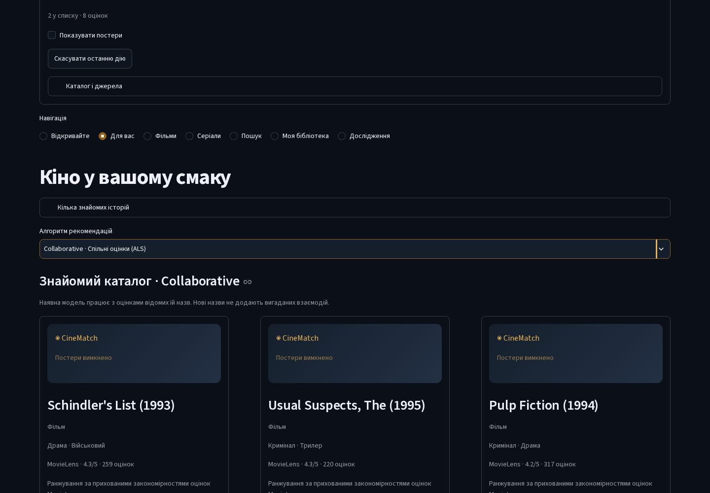

# ◉ CineMatch

**Stories that stay with you. / Історії, що залишаються з вами.**

A bilingual, local-first movie and series discovery app built with Python and
Streamlit. Explore real metadata, search Ukrainian or English titles, rate
familiar films, compare recommender algorithms and keep a local library.

Двомовний локальний застосунок для відкриття фільмів і серіалів: справжні
метадані, український та англійський пошук, прозорі рекомендації й особиста бібліотека.

**Status / Статус:** v1.3 is integrated and verified. v1.4 is a portfolio candidate
in unmerged review PRs. **No public live demo, deployment or Release exists.**
Run the safe demonstration locally; paid services, accounts and TMDB are optional.

[Quick start / Запуск](#quick-start--швидкий-старт) ·
[Engineering case study / Кейс](docs/portfolio-case-study.md) ·
[Architecture / Архітектура](docs/architecture-v14.md) ·
[QA evidence / Перевірка](docs/qa-v14.md) ·
[Four-minute demo / Показ](docs/demo-video-v14.md)



These are actual application captures using real public metadata and a clearly
synthetic profile. New screenshots disable third-party artwork; neutral branded
fallbacks are implemented UI. [Capture provenance](assets/v14/README.md).

Скріншоти зроблено зі справжнього застосунку. Оцінки прикладу синтетичні;
історію власника не використано. Постери вимкнено для поширюваних матеріалів.

## What you can do / Можливості

- **Discover / Відкривайте:** explained collections with a dated, credential-free
  selection of 22 films and eight series; source links and legitimate Ukrainian labels.
- **Search / Пошук:** indexed matching, Ukrainian/English titles, transliteration,
  release-year disambiguation, media/genre/year/rating filters and useful empty states.
- **For You / Для вас:** explicit selection among seven existing modes for known
  MovieLens films; separate modern metadata heuristics and visible missing-model fallbacks.
- **Details & library / Деталі й бібліотека:** source-attributed information,
  ratings, watched/watchlist/exclusions, Undo, local JSON backup and compatible profiles.
- **Portfolio demo / Деморежим:** reproducible synthetic preferences, independent
  visitor state, reset and refresh, no local profile stores or provider credentials.
- **Research / Дослідження:** original methodology, explanations and surviving
  evidence, including the **unverified historical +17.8% Adaptive claim**.



## Quick start / Швидкий старт

Use Python **3.10 or 3.11**. No GPU, LLM, API token or account is required.

```bash
python -m venv .venv
source .venv/bin/activate
python -m pip install -r requirements.txt
python -m streamlit run app/portfolio_app.py --server.address=127.0.0.1
```

Windows PowerShell / Windows:

```powershell
python -m venv .venv
.venv\Scripts\python.exe -m pip install -r requirements.txt
.venv\Scripts\python.exe -m streamlit run app/portfolio_app.py --server.address=127.0.0.1
```

Open [localhost:8501](http://127.0.0.1:8501). The shipped 30-title metadata fixture
works without downloads. **Initially this is metadata and genre heuristics.**
For the actual historical ML demonstration, stop the app, explicitly prepare its
separate bounded public development pack, then start the same entry again:

```bash
python -m scripts.prepare_portfolio --directory data/portfolio
```

Existing destinations are refused, not overwritten. Official GroupLens archive
hashes are verified; the pack/model stays outside Git. In **For You**, select
**Collaborative** for matrix factorization. Default Adaptive without a learned
policy uses its original community-quality fallback for films; missing Semantic
text artifacts use the original genre fallback. No new ML quality gain is implied.

Українською: без завантаження працюють метадані й жанрові евристики. Окремий
public pack потрібен для показу справжньої історичної ML-моделі. Оцінки прикладу
можна змінювати; кнопка відновлення й оновлення сторінки повертають початковий стан.

For the ordinary private **local** application / Для звичайного локального режиму:

```bash
python -m streamlit run app/streamlit_app.py --server.address=127.0.0.1
# Optional full historical development catalog and ordinary numerical artifacts:
python -m scripts.download_data
python -m scripts.download_movies
python -m scripts.train
# Explicit optional provider refresh:
python -m scripts.sync_catalog --directory data/discovery --pages 1
```

The local entry preserves SQLite/CAS, schemas 2–6, JSON import/export and optional
TMDB. It is **not** a secure anonymous multiuser service. The portfolio entry
never overwrites its profiles. Metadata remains usable offline; disable posters
for browsing without external image requests. [Demo setup and threat model](docs/portfolio-demo.md).

## Stack and algorithms / Стек та алгоритми

Python · Streamlit · NumPy/Pandas/SciPy · scikit-learn · SQLite · pytest/AppTest ·
Ruff/Mypy/pre-commit · optional Playwright/axe · Docker · GitHub Actions/CodeQL.

| Mode / Режим | Implemented approach / Підхід |
|---|---|
| Collaborative | Biased matrix factorization, ALS-style solves / Матрична факторизація зі зміщеннями |
| Item-KNN | Item-neighbor rating similarity / Схожість оцінених фільмів |
| Content-based | Genre affinity / Жанрова схожість |
| Popularity | Historical community ratings/counts / Історична якість спільноти |
| Hybrid | Existing collaborative/content combination / Наявне поєднання сигналів |
| Semantic | Optional TF-IDF + LSA artifacts; explicit fallback / Текстові артефакти або позначений резерв |
| Adaptive | Existing optional mixing policy; default quality fallback / Наявна політика або резерв за якістю |

The catalog facade keeps provider namespaces separate and joins only unique
IMDb/type/year matches. Modern discovery is a separately disclosed heuristic;
metadata never creates fabricated training ratings. Optional MiniLM belongs to
an offline research workflow. [Implemented architecture](docs/architecture-v14.md).

## Quality and measured limits / Якість і вимірювання

233 local tests passed with cached optional CPU weights; Docker/default CI use
231 passed and two explicit skips. Linux 3.10/3.11 and Windows 3.11, Ruff,
configured Mypy, pre-commit, audits and CodeQL are checked. Real browser coverage
includes desktop/mobile/tablet, Ukrainian search, filters, rating, Undo, two
visitors, reset, refresh and internet-offline metadata. Basic axe checks do not
certify WCAG; an incomplete ARIA item and manual screen-reader/hardware checks remain.
[Full evidence and conditions](reports/engineering_v14.json).

The current same-fixture cold startup changed **393.87 → 410.73 ms**, warm rerun
**14.99 → 20.47 ms** after framework/accessibility work: a small regression,
not an optimization claim. Original recommendation output hash is unchanged.
Five bounded public-pack service sessions peak around 122 MiB; this is not a
concurrent hosted-load guarantee. Historical v1.3 engineering results remain intact.

Українською: тести перевіряють функціональність і відтворюваність, а не доводять
якість ранжування. Історичні **+17,8% не підтверджено**; cohort v1.2 із 326
користувачів уже використано. Новий final holdout не запускався. Майбутній приріст
потребує нового протоколу, невикористаних даних і статистичних інтервалів.

## Privacy and licensing / Приватність і ліцензії

Code is [MIT](LICENSE). Data, artwork and provider marks have separate terms:
[MovieLens/provider guide](docs/catalog-providers.md),
[Wikidata CC0 / TVmaze CC BY-SA snapshot](assets/demo/LICENSE.md).
The 30-title fixture is dated and deliberately small; all labels are traceable,
not generated translations. Live TMDB was not tested because no token was available.
No API keys, private SQLite files or owner history are included.

Local data stays local. Portfolio preferences live in one visitor session; the
app has no shared writable user store or visitor file import. Enabled posters
send browser network information to TVmaze; they can be disabled. Hosting
isolation was tested locally/CI, not certified on a public platform. Attribution
was reviewed; complete third-party legal compliance is not claimed.

## Roadmap and contribution / Розвиток і внесок

Owner review of [#20](https://github.com/Bandoof/CineMatch/pull/20) →
[#21](https://github.com/Bandoof/CineMatch/pull/21) →
[#22](https://github.com/Bandoof/CineMatch/pull/22) → presentation PR; then manual
accessibility review and the narrated recording. [Hosting comparison](docs/hosting-v14.md)
recommends Community Cloud as the initial free candidate, subject to separate
owner approval. No automatic v1.4 merge, deployment, tag or GitHub Release.

Future v2.0 research: a newly registered untouched evaluation, carefully sourced
Ukrainian coverage, calibrated explanations and measured hosted resource limits.
Keep the project local-first; no commercial multiuser rewrite is planned.

Questions, bug reports and contributions: [GitHub issues](https://github.com/Bandoof/CineMatch/issues)
and reviewed PRs. v1.4 was prepared with AI-assisted engineering; owner review
and understanding are required before claims of personal authorship.

[Українська локальна інструкція](Почати.md) ·
[Historical/classic guide](docs/classic-guide.md) ·
[v1.3 evidence](docs/release-v13.md) · [Recovery state](docs/progress-v14.md)
