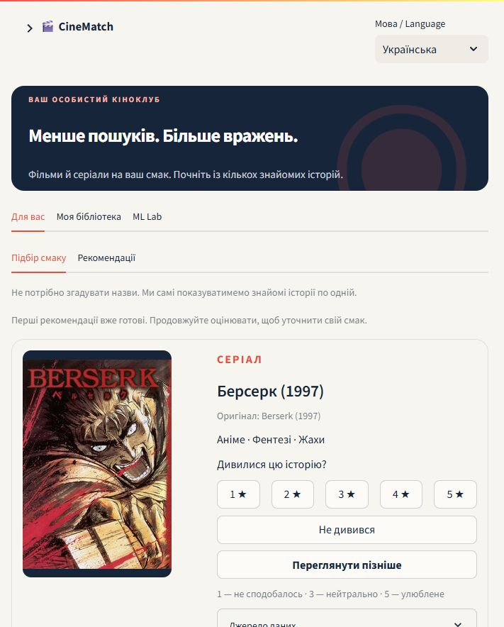
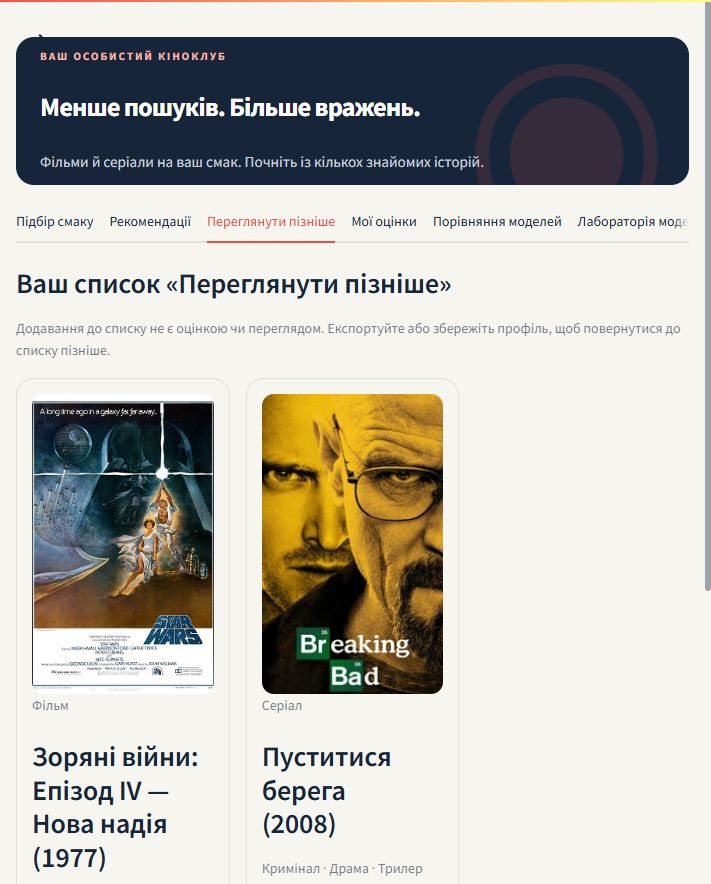
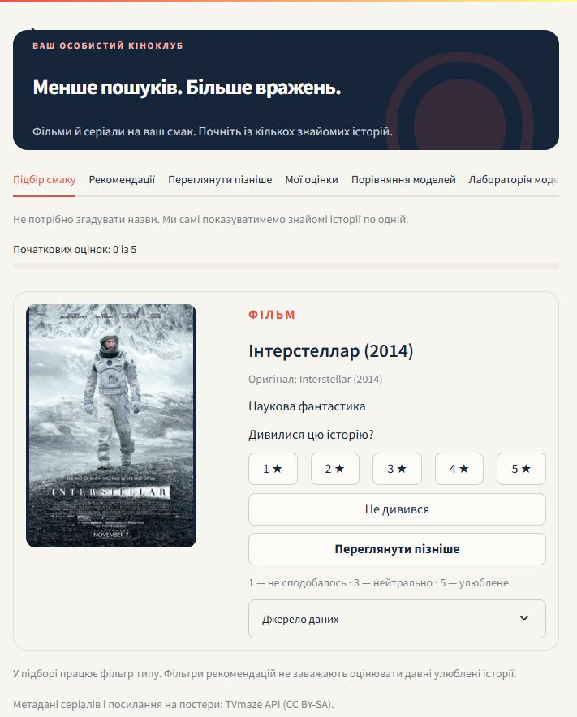
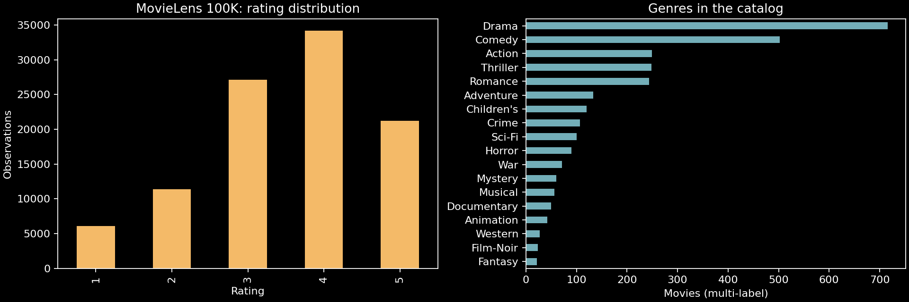
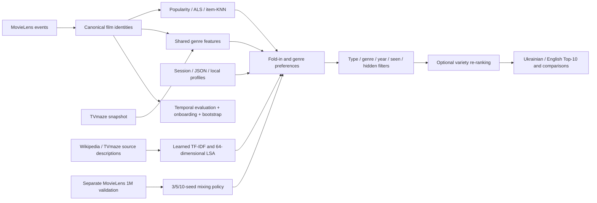

# 🎬 CineMatch

[](https://github.com/Bandoof/CineMatch/actions/workflows/ci.yml)

[](LICENSE)

**Recognise a story. Rate it. Find your next favourite.**

A recommendation systems portfolio project with seven algorithms, chronological
evaluation, an interactive Ukrainian/English interface and real TV series metadata.
Built around Python, NumPy, Pandas and Streamlit. No LLM or API key is required.

[Українська інструкція](Почати.md) · [Model card](docs/ml-v3-model-card.md) · [Measured benchmark](reports/ml_v3.md)



The screenshot shows the actual current interface. The [earlier walkthrough](assets/cinematch-demo.gif)
documents the previous layout.
Movie images link to Wikipedia; series posters link to TVmaze. No artwork is
included in the source package apart from screenshots of the application.

## Quick start / Швидкий старт

Python 3.10/3.11: create a virtual environment, install `requirements.txt`, run
`python -m scripts.download_data` and `python -m scripts.train`, then
`python -m streamlit run app/streamlit_app.py --server.address=127.0.0.1`.
This starts the minimal film catalog; verified Ukrainian names, series and expanded
content require the explicit [full setup](#run-locally). Tests need no downloads.

[Development](docs/development.md) · [Architecture](docs/architecture.md) ·
[Contributing](CONTRIBUTING.md) · [Security](SECURITY.md) · [Changelog](CHANGELOG.md) ·
[Owner GitHub settings](docs/github-maintenance.md)

Українською: локальний застосунок радить фільми й серіали, зберігає оцінки,
«Переглянути пізніше» та історію. [Повна українська інструкція](Почати.md).
Особиста база залишається на вашому ПК; клонування репозиторію її не переносить.

## Experience

1. Start with **Find my taste**: recognise one film or series at a time, rate it
   from 1 to 5 or choose **Haven't watched**. The next card appears automatically.
   Undo an accidental answer. Search remains available on the recommendations tab.
2. Explore Top-10 results; filter **All / Movies / Series**, genre and release year.
   Save a title to **Watch later** from recognition or recommendation cards.
   **Already watched** removes it from future suggestions; an optional rating
   improves personalisation. A watched title without a rating is never a fake score.
3. Choose an algorithm and adjust variety using genre-based MMR re-ranking.
4. Choose **Not interested**: this title only, similar themes, or not now.
   Undo the last choice or restore individual titles in your profile. Feedback is
   distinct from star ratings and is saved in the profile.
   Edit ratings and inspect positive/negative genre signals.
5. Compare two models with the same profile and filters; see shared results.
6. Automatically remember your current library and language locally; also export/import JSON or save named profiles.
   Version 5 includes ratings, topic/title-only feedback, unwatched titles, watched history and watchlist.
   Older profile versions still import. Automatic memory restores changes locally;
   use named profiles or JSON for additional copies.
7. Explore ranking metrics, bootstrap intervals and 3/5/10-rating onboarding tests.

Ukrainian is the default UI language; the visible header switches to English without
discarding ratings. Ukrainian titles come from identity-matched Wikidata labels.
The default Ukrainian view shows titles with verified Ukrainian names. Disable
**Only titles with Ukrainian names** to include original names where a translation
is unavailable. Both original and Ukrainian names are searchable in either language.
The demo is visibly labelled as sample ratings, not the visitor's history.

The expanded snapshot contains **10,123 films and 602 series**. It combines
MovieLens 100K with the official **latest-small development snapshot** through
2018, retaining old film IDs and keeping the two datasets' user IDs separate.
The Dark Knight (2008), Intouchables / 1+1 (2011), Interstellar (2014) and
Léon (1994) are available with verified Ukrainian names and image links.
Search recognises aliases, both languages, accents (Léon/Leon) and punctuation.
Literal search also finds watched titles so existing ratings can be edited.

There are **6,048 Ukrainian film names and 387 series names** (6,435 / 10,725
items). Seventy-one Latin-only source labels were excluded from the Ukrainian-name
filter; the raw source has 6,506 labels. There are image links for **9,395 films**
and posters for **602 series**. Missing
URLs have a placeholder. Wikipedia page images may be logos or other representative
images as well as posters. The catalogs are partial, not a live database of every
new release. The source snapshot and checksum are recorded locally.

In **All**, Top-10 reserves up to five places for films and five for series,
alternating sources and filling spare places when one type has too few matches.
Single-type filters retain normal ranking. This avoids comparing incompatible
MovieLens and TVmaze community scales as if they were calibrated predictions.

The recognition queue starts with familiar titles, then rotates across media and
genres. It uses the media filter rather than the narrower recommendation filters.
**Haven't watched** only excludes a title from recognition prompts: it is neither
a dislike nor an exclusion from recommendations. Skipped titles persist in saved
profiles and can be revisited separately.



## Models



| Model | Approach | Purpose |
|---|---|---|
| Adaptive | Validation-selected ALS / LSA / quality mixing by seed count | New-user ranking policy |
| Semantic | TF-IDF + trained 64-dimensional LSA of EN/UK descriptions | Content retrieval and cold-item support |
| Popularity | Bayesian weighted MovieLens rating | Reference and cold-start fallback |
| Content-based | Signed rating-weighted genre cosine | Personalisation including dislikes |
| Collaborative | Biased matrix factorization, NumPy ALS | Learn observed user/movie rating patterns |
| Item-KNN | Mean-centred, co-rating-shrunk cosine | Compare a classical item-similarity baseline |
| Hybrid | Validation-selected ALS, genre and community-quality blend | Personalisation with a quality prior |

New visitors receive a latent user vector by fold-in ridge regression against fixed
movie factors. Item-KNN uses their observed film ratings as neighbours.

**Series have no collaborative training interactions.** TVmaze supplies metadata
and community averages, not individual viewing histories. Series use genre scores
and TVmaze ratings; Collaborative, Item-KNN and Hybrid explicitly disclose this
fallback. Your series ratings still influence genre preferences across both catalogs.
For a series-only profile, Hybrid ranks films using 75% genre affinity and 25%
weighted MovieLens quality, rather than the validation alpha for film-rated users.
This cold-start heuristic has not been evaluated on series interactions. The
existing film benchmark and its scores are unchanged.
Missing TVmaze ratings remain visibly unavailable; a neutral internal prior is
used only for ranking. The 1–5 MovieLens and 1–10 TVmaze averages remain labelled.
Mixed-catalog scores are a heuristic, not a calibrated personal rating prediction.

## Current release: content learning and a visible ML Lab

The navigation has three destinations: **For you**, **My library**, **ML Lab**.
The language switch stays visible in the header. Recommendations use responsive
poster cards; details reveal source descriptions, credits and measured text
overlap with a highly rated title. Missing Ukrainian descriptions are labelled
as English source text, never invented translations.

The new local model learns TF-IDF unigrams/bigrams and a 64-dimensional latent
semantic projection from actual English/Ukrainian Wikipedia leads and TVmaze
descriptions. Signed rating-weighted vectors account for likes and low ratings.
This is **latent semantic analysis, not a Transformer or an LLM**. Vocabulary and
projection training are explicit and reproducible; there is no external API at inference.
Short topic requests use 75% description similarity and 25% the selected model
ranking. This is lexical/latent retrieval, not a conversational intent parser.
Zero-word matches disclose that the original ranking was kept. Set the minimum
film vote filter to zero to admit titles without training interactions.

**Adaptive** combines collaborative, content and Bayesian-quality scores using
weights selected separately after 3/5/10 seed ratings. The independent 1M experiment
chooses those weights on validation only. The application transfers them to its
separate expanded catalog, so benchmark results are not deployment-quality claims.
Without a valid matching experiment, the film policy falls back to community
quality. Series and series-only histories retain a disclosed content/quality heuristic.

**Not interested** has three meanings: this title (exclusion only), similar themes
(exclusion plus bounded 20% genre and 10% positive content-similarity discounts),
or not now (session-only exclusion). Neither becomes a star rating. Persistent
topic seeds are separate from exclusions in schema 5; older exclusions retain
their original topic-feedback meaning. Undo and restore update both fields.
After three ratings, recognition can probe less-covered themes among the first
80 recognisable candidates. This exploration rule has not been validated as an
active-learning gain and is not a calibrated confidence estimate.

**ML Lab** shows real before/after Top-10 lists for the latest rating, dismissal
or viewing mark under the same current filters and model. A changed list is not
an accuracy improvement. It also presents an independent MovieLens 1M experiment
with ranking metrics, coverage, genre diversity, novelty and paired user bootstrap
intervals. Current source descriptions are retrospective metadata; the protocol
does not claim historical text was available at each rating boundary. Series,
negative feedback and live satisfaction are outside that benchmark.

[Current experiment](reports/ml_v3.md) · [Model card and protocol](docs/ml-v3-model-card.md)

To reproduce the content/experiment, after installing the expanded catalog:

```bash
python -m scripts.download_content
python -m scripts.download_benchmark
python -m scripts.benchmark_v3
```

Restart the app after generating artifacts. Each content download resumes from
completed batches. Wikipedia and TVmaze source descriptions retain CC BY-SA
attribution links. Dataset use remains subject to the original MovieLens terms.

## Expanded model: measured tradeoffs (archived)

The app model is retrained on **200,836 real rating events** from two separate
user namespaces. On this pinned development snapshot, a chronological
160,668 / 20,084 / 20,084 split tunes 64 ALS/blend configurations on validation.
The selected ALS model has 32 factors, regularization 10 and 15 epochs. For
film-rated profiles, the archived Hybrid uses **60% collaborative predictions and
40% Bayesian community quality**; validation chose zero genre weight here.
Series-only profiles retain their explicit genre fallback.

| Model | Precision@10 | Recall@10 | NDCG@10 | Coverage | Diversity |
|---|---:|---:|---:|---:|---:|
| Hybrid | 0.0607 | 0.0298 | 0.0563 | 0.0128 | 0.7651 |
| Collaborative | 0.0464 | 0.0214 | 0.0408 | 0.0159 | 0.7428 |
| Item-KNN | 0.0036 | 0.0018 | 0.0039 | 0.0298 | 0.7370 |
| Content-based | 0.0036 | 0.0005 | 0.0079 | 0.0209 | 0.0867 |
| Popularity | 0.0607 | 0.0251 | 0.0679 | 0.0035 | 0.7818 |

Compared with the previous default architecture retrained on the **same expanded
data**, test Precision@10 changes **0.0536 → 0.0607** and Recall@10
**0.0216 → 0.0298**, while NDCG@10 changes **0.0582 → 0.0563**. Coverage
falls **0.0208 → 0.0128**. This is a tradeoff, not a general accuracy win.
The cohort has only **28 warm users**; the paired 95% NDCG difference interval
**[-0.0260, 0.0184]** includes zero. More ratings or a more complex model do
not guarantee better recommendations. Onboarding uses the selected parameters
with the entire evaluation users' histories removed from background training.

Details: [expanded report](reports/expanded_benchmark.md),
[measured JSON](reports/expanded_metrics.json), [upgrade review](docs/movie-upgrade-review.md).
The original 100K benchmark below is archived and cannot be compared numerically
to this different catalog/cohort. Series, mixed-type quotas and not-interested
feedback have behavioural tests but no measured interaction-quality benchmark.

Item-KNN now uses sparse observed-rating matrices and bounded score batches;
it never constructs a 10,123 × 10,123 similarity matrix. Its persistent matrices
use about **4.8 MB** on this snapshot. A regression test matches the former dense
adjusted-cosine formula. Bounded profile-scoring cache and direct row lookup avoid
repeating inference and title lookup across tabs without sharing mutable results.

## Original MovieLens 100K benchmark (archived)

The original MovieLens 100K catalog has 1,682 rows. Eighteen duplicate identities
are consolidated into **1,664 films**, retaining aliases for old profiles. All
100,000 timestamped source events are retained before splitting; only the latest
available user/title rating is used within each training boundary.

Global chronological 80/10/10 partitions contain 80,003 / 9,997 / 10,000 events
because timestamp ties stay together. Hybrid alpha **1.0** is selected by validation
NDCG@10. The app's full-data model is never used in evaluation.

<!-- measured-table-start -->
| Model | Precision@10 | Recall@10 | NDCG@10 | Coverage | Diversity |
|---|---:|---:|---:|---:|---:|
| Popularity | 0.1091 | 0.0828 | 0.1217 | 0.0271 | 0.7327 |
| Content-based | 0.0558 | 0.0395 | 0.0545 | 0.1523 | 0.1346 |
| Collaborative | 0.0831 | 0.0396 | 0.1072 | 0.1628 | 0.6767 |
| Item-KNN | 0.0260 | 0.0256 | 0.0322 | 0.2324 | 0.7609 |
| Hybrid | 0.0818 | 0.0393 | 0.1017 | 0.1628 | 0.6770 |
<!-- measured-table-end -->

Popularity has the highest test NDCG in this run, with lower catalog coverage.
The paired bootstrap interval for Collaborative minus Popularity includes zero;
this small historical cohort does not establish a reliable winner for new users.
The 77-user warm test contains 1,544 positive user/title labels, including 37
unavailable before the boundary. Those unavailable positives remain in recall/NDCG
denominators. No sampled negatives or future popularity counts are used.

Separately, all histories of **76 onboarding test users** are removed from model
training. Each receives only their latest 3, 5 or 10 pre-boundary ratings. A matched
cohort is used across profile lengths; more ratings do not guarantee monotonic gains.
The report also contains 1,000 paired user bootstrap samples and a fixed-cohort
quality/variety comparison. Default variety is zero, not selected on the test set.

These evaluations concern **MovieLens films only**. They do not measure TV-series
quality, live satisfaction or modern movie coverage. Full results:
[JSON](reports/metrics.json), [CSV](reports/metrics.csv), [protocol](docs/methodology.md).

## Run locally

### Public error messages and maintenance

The entry point catches application/import failures, clears its partial main
page and shows a neutral Ukrainian/English message with **Try again**. Technical
details are logged on the server with a random reference code and hidden in the
browser. This handles application failures while Streamlit is running; a stopped
server or lost connection needs a hosting-level fallback page for a public deployment.

For planned updates, run `python -m scripts.maintenance on` and refresh the page.
Users see **Maintenance in progress** without loading the catalog or models.
Run `python -m scripts.maintenance off` when ready, restart the app after code
changes, then refresh. The maintenance flag is local and excluded from the archive.

Python 3.10 or 3.11, from this directory:

```bash
python -m venv .venv
```

```powershell
# Windows; direct interpreter calls avoid changing PowerShell execution policy
.venv\Scripts\python.exe -m pip install -r requirements.txt
.venv\Scripts\python.exe -m scripts.download_data
.venv\Scripts\python.exe -m scripts.download_movies
.venv\Scripts\python.exe -m scripts.download_series
.venv\Scripts\python.exe -m scripts.download_metadata
.venv\Scripts\python.exe -m scripts.download_content
.venv\Scripts\python.exe -m scripts.train --expanded
.venv\Scripts\python.exe -m streamlit run app/streamlit_app.py --server.address=127.0.0.1
```

On macOS/Linux activate with `source .venv/bin/activate`, then use `python` for
the same commands. Open [localhost:8501](http://127.0.0.1:8501).
After setup Windows users can double-click **START_CINEMATCH.cmd**.
The launcher checks readiness, starts Streamlit in the background without an
inherited console, and opens the browser. It reuses a healthy server and does
not terminate other processes on port 8501. After a computer restart, launch it
again. Startup diagnostics are in `data/runtime/server.log`.

Downloads are explicit setup steps. Missing series data leave the film app usable.
The default snapshot fetches the first three TVmaze index pages, restricted to
scripted/animated shows, plus twelve named modern titles: **602 series** in the
tested snapshot. This is a subset, not the complete TVmaze catalog. Refresh using
`python -m scripts.download_series`; `--pages` increases index coverage (max 20).
Fetched date and attribution links appear in the interface. Download presentation
metadata with `python -m scripts.download_metadata`; interrupted downloads resume
from the saved batches. Re-running series download does not invent interaction data.
Images are enabled by default and require internet; they can be switched off.

Limit BLAS threads before training/evaluation for predictable small-matrix speed:
`$env:OPENBLAS_NUM_THREADS='1'` in PowerShell, or `export OPENBLAS_NUM_THREADS=1` on Unix.
Saved numeric NPZ models are fingerprinted. The app cache observes data, series,
presentation metadata, model and benchmark file changes, including newly created files.

## Profiles and deployment

The standard launch binds to `127.0.0.1`; CORS and XSRF protection remain enabled,
static file serving is disabled, and uploads are limited to 1 MB. Docker Compose
also publishes only to localhost. Security fixes and verification scope are
recorded in [security review](docs/security-review.md).

Automatic memory is enabled by default for local installations. Ratings, watched
titles, watch-later, skipped prompts, Not interested, language and filter preferences
are saved after changes and restored after a page/server restart. The sidebar can
disable automatic memory; demo history never replaces the personal snapshot. A
separate SQLite row preserves the current state without modifying named profiles.
Concurrent tabs cannot silently overwrite a newer saved state: the stale tab warns
and retains its changes for JSON export. Storage failures are shown neutrally and
leave existing saved data intact. JSON contains rated
IDs/titles, hidden IDs and unwatched IDs; import validates the entire file before replacing the
profile. Original `{movie_id: rating}` exports remain supported, including aliases.
Schema 5 separates title-only and topic exclusions; schema 4 preserves library
state, schema 3 recognition skips. All these versions, schema 2 and original
rating-only JSON remain supported.
Unknown IDs, conflicting duplicate ratings, non-finite scores and files over 1 MB
are rejected. Series IDs are negative TVmaze IDs, keeping them separate from films.

Named profiles use `data/profiles.sqlite3` by default. They are shared by everyone
using this installation, with no account authentication. For a shared/public
deployment set `CINEMATCH_LOCAL_PROFILES=0` (disables both named local profiles and
automatic memory) and use per-session JSON export/import until authenticated storage
is implemented. Local memory is one shared current profile per installation, not
separate browser accounts. `CINEMATCH_AUTOSAVE=0` disables automatic memory alone.
Do not use this local store as multi-user private storage. Source packages exclude
all data, saved profiles and trained models.

Optional environment settings: `CINEMATCH_DATA_DIR`, `CINEMATCH_SERIES_FILE`, `CINEMATCH_METADATA_FILE`, `CINEMATCH_CONTENT_FILE`,
`CINEMATCH_ARTIFACT_ROOT`, `CINEMATCH_PROFILE_DB`, `CINEMATCH_DEFAULT_LANGUAGE` (`uk`/`en`).

## Reproduce and verify

```bash
python -m pip install -r requirements-dev.txt
python -m scripts.eda
python -m scripts.evaluate
python -m ruff check .
python -m pytest -q
```

The EDA notebook in `notebooks/` can run in a Jupyter environment; Jupyter is not
needed for the app. Every code cell was executed during packaging.



The suite covers model fold-in/error, canonical identity and historical event
boundaries, rated/hidden exclusion, item-KNN, series filtering and fallbacks,
profile validation/persistence, recognition skips/undo/reload, localized-title identity
and model-score invariance, paired bootstrap, onboarding user exclusion,
artifact cache refresh, and interactive Ukrainian/English workflows.
GitHub Actions is configured for Python 3.10/3.11 with synthetic data. The equivalent
checks passed locally and in Linux Docker. The first hosted GitHub Actions run
also passed Ruff and pytest on Python 3.10 and 3.11:
[verified run](https://github.com/Bandoof/CineMatch/actions/runs/37924477380).

## Docker

```bash
docker compose build
docker compose run --rm cinematch python -m scripts.download_data
docker compose run --rm cinematch python -m scripts.download_movies
docker compose run --rm cinematch python -m scripts.download_series
docker compose run --rm cinematch python -m scripts.download_metadata
docker compose run --rm cinematch python -m scripts.download_content
docker compose run --rm cinematch python -m scripts.train --expanded
docker compose up -d
```

Named volumes persist data (including local profiles) and models. The port binds
to localhost and the container runs as an unprivileged user with a health check.
For the independent ML Lab experiment, also run `scripts.download_benchmark` and
`scripts.benchmark_v3` in the same Compose service before restarting it.
`scripts.report_v3` exports the optional scientific figure and needs the development
dependencies (Matplotlib); it is not required to run the app.

```bash
docker build --target test -t cinematch-test .
docker run --rm cinematch-test
docker run --rm cinematch-test python -m ruff check --no-cache .
```

See [verification](docs/verification.md) for actual execution results.

## Architecture



## Data and licences

Code is MIT licensed. Datasets and posters have separate conditions.

- [MovieLens 100K](https://grouplens.org/datasets/movielens/100k/) has 100,000
  ratings by 943 users from 1997–1998. The downloader uses the official HTTPS
  archive, verifies SHA-256, and extracts only items, ratings and the README.
  Films end in 1998; Interstellar and The Matrix are absent. Read the
  [original research-use terms](https://files.grouplens.org/datasets/movielens/ml-100k/README).
  Acknowledge GroupLens; redistribution and commercial use require permission.
- [TVmaze API](https://www.tvmaze.com/api#licensing) provides the series metadata
  under CC BY-SA. Snapshots record attribution and the licensing link; each series
  card links back to its TVmaze page. Poster links remain with their
  source; the MIT code licence grants no separate rights to artwork.
- [MovieLens latest-small](https://grouplens.org/datasets/movielens/latest/) supplies
  `movies.csv`, `links.csv` and real `ratings.csv` for the expanded app and its
  separate development evaluation. Its film and user IDs have distinct namespaces
  from 100K. Exact alternate names and release years preserve old film identities;
  ambiguous matches do not overwrite them. The archived 100K benchmark excludes
  this second dataset. Read the development snapshot's licence and recorded checksum.
- [Wikidata](https://www.wikidata.org/wiki/Wikidata:Data_access) supplies Ukrainian
  labels via exact IMDb IDs. Structured metadata is CC0; each translated title
  links to its entity. Stale title/year mappings are rejected.
- [Wikipedia PageImages](https://www.mediawiki.org/wiki/Extension:PageImages)
  supplies image URLs for the identity-matched English article. Image rights differ
  per file, including non-free posters: follow **Image source** for attribution and
  usage conditions. Remote artwork is not downloaded into the source package or
  covered by its MIT licence. Images require internet; ranking and cached labels
  work offline. Source requests are bounded, resumable and identify CineMatch.

Neither raw dataset nor personal profiles are included in the source archive or Git.
MovieLens acknowledgement: F. Maxwell Harper and Joseph A. Konstan (2015),
*The MovieLens Datasets: History and Context*, ACM TiiS 5(4), Article 19.
[DOI](https://doi.org/10.1145/2827872).

## Next experiments

Stronger content features, modern film metadata with reliable entity matching,
temporal decay, and separately licensed series interaction data would address the
largest limitations. An API is useful when another client needs the same service.
These are future experiments, not completed features or deployments.

To reproduce expanded tuning/evaluation and training, run
`python -m scripts.improve_movies` with one BLAS thread. The original
`scripts.evaluate` still evaluates the archival 100K dataset only.
Latest-small is a development dataset: report its pinned checksum and do not
present its changing snapshot as a stable shared research benchmark.
Source: [GroupLens latest-small README](https://files.grouplens.org/datasets/movielens/ml-latest-small-README.html).

Related-project review and prioritized proposals: [GitHub comparison](docs/github-comparison.md).
Automatic-memory and Linux verification: [verification record](docs/verification.md).
