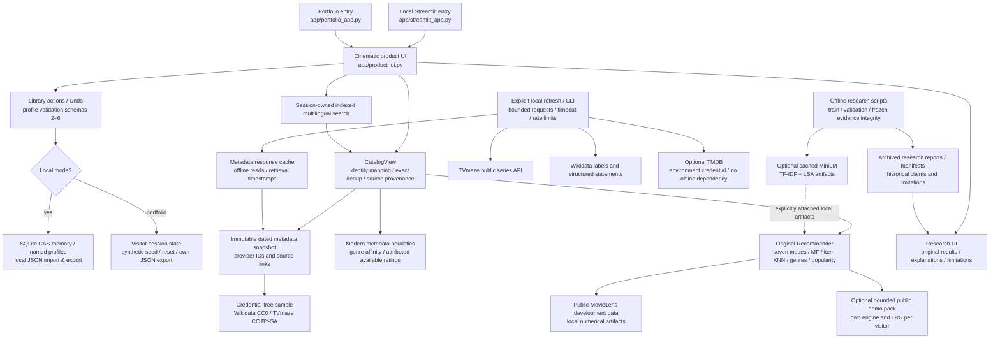

# Architecture / Архітектура v1.4

The historical engine's numerical formulas and production Adaptive default are
unchanged. Its scores cover its known MovieLens identities. Modern metadata
never creates training observations. Semantic without an attached text artifact
falls back to genres; Adaptive without a learned mixing policy falls back to
community quality for films. These conditions are visible in For You.

Portfolio mode never constructs SQLite/profile stores or provider clients. It
uses the committed 30-title dated snapshot and, if explicitly prepared, its own
bounded public development pack. The original global profile LRU is rebound to
each visitor with the same underlying formula. The index and mutable preferences
are session-owned. Provider response caches belong to explicit local operations,
not anonymous visitors. Optional artwork is fetched by the browser from TVmaze;
no visitor preference or query is sent to that provider by the demo server.

Українською: Streamlit керує інтерфейсом; CatalogView узгоджує ідентичності, але
не змінює навчальні оцінки. Локальний режим зберігає профілі через SQLite/CAS.
Демонстрація тримає лише синтетичний стан поточної сесії й окремий кеш результатів.
MovieLens залишається історичною ML-базою; нові назви — метадані й явно позначені
евристики. Дослідницький pipeline незалежний від показу, його докази не переписано.

This diagram describes the implemented candidate, not a deployed multiuser
service. Hosting security and admission limits remain platform/operator work.
