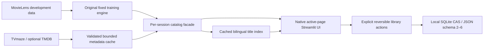

# Architecture / Архітектура

CineMatch is a single local Python process with Streamlit sessions and SQLite.
It has no account service, external vector database or online training service.

| Layer | Responsibility | Dependencies |
|---|---|---|
| `app/streamlit_app.py` | Startup, maintenance and neutral failure page | Streamlit, interface |
| `app/product_ui.py`, `app/ml_lab.py` | Active-page consumer UI, details/library and research | Catalog facade, runtime, interchange |
| `app/interface.py` | Explicit classic compatibility UI | Original runtime/ranking service |
| `src/modern_catalog.py`, `src/providers.py`, `src/catalog_view.py` | Namespaced metadata, strict clients/cache and cold-title facade | Original engine stays fixed |
| `src/discovery_search.py`, `src/discovery_collections.py` | Session-cached title index and truthful collections | Validated catalog, actual signals |
| `app/runtime.py` | Bounded engine cache, validated artifacts and fallbacks | Catalog/loaders, numerical models |
| `app/recommender.py` | Shared scoring, exclusions, mixed-media quotas, explanations | Pure numerical modules in `src/` |
| `src/collaborative.py`, `item_knn.py`, `semantic.py` | ALS, observed-rating KNN, TF-IDF/LSA | NumPy/SciPy/scikit-learn |
| `src/profile_actions.py`, `src/library_actions.py` | UI-independent reversible state transitions | Mutable state mapping; no Streamlit or I/O |
| `src/profiles.py`, `src/memory.py`, `app/memory.py` | JSON interchange, named profiles, autosave bridge | Local SQLite, UI state |
| `scripts/` | Explicit download, train, evaluate and maintenance commands | Official data sources and local artifacts |

Data is downloaded explicitly into ignored `data/`. Catalog canonicalization keeps
old IDs as aliases; film IDs are positive and TVmaze series IDs negative. Chronological
evaluation partitions events before fitting; the running app's full-data model is
not used to report test quality. Models are numerical NPZ files with fingerprints.
Metadata joins require verified source identity; display language does not change scores.

A UI action updates session state; `main()` saves in `finally`, including rerun actions.
Demo state is deliberately excluded from autosave. SQLite revisions reject stale writes
from a second session. JSON supports legacy mappings and schemas 2–5; import validates
before replacing current state. Schema 6 adds minimal provider identity references
only when needed, staged atomically; no SQLite migration. Watchlist, unwatched skips, watched history and
negative-topic feedback have different meanings and must remain separate.

Runtime cache keys include file path, modification time and size for catalogs/models/
reports/metadata. Engine entries are bounded to three; score-component entries to eight.
Returned score arrays are copied so UI/evaluation callers cannot mutate the cache.
This is reuse of trusted local artifacts, not a cross-user profile store. Corrupt models
can be rebuilt; missing metadata or series use explicit fallbacks.

Series lack MovieLens-style individual interactions and use disclosed content/quality
fallbacks. The historical benchmark concerns films, not series or live satisfaction;
its v3 validation/test target overlap is disclosed and it is not fresh holdout evidence.

The v1.3 facade retains the exact training-engine catalog/features/scores. Modern
metadata only overlays presentation or adds separate cold identities. TVmaze keeps
negative show IDs; TMDB movies use `-1_000_000_000_000-id`, series use
`-2_000_000_000_000-id`. Mapping requires established provider identity or unique
IMDb + media type + release year; names never establish identity.

Search postings/trigrams are built once per session view revision. Only the active
native page and at most 12 cards render; details/API enrichment require explicit
actions. Provider response cache: fresh 6 hours, stale fallback 14 days, at most
100 files/100 MB; saved catalog at most 5,000 modern titles/30 MB. Snapshot dates
remain visible and training reports do not become catalog caches. Failed imports,
missing keys, invalid API responses and storage failures preserve existing data.

Provider terms: [catalog-providers.md](catalog-providers.md). Current behavior and
rollback: [product-ui.md](product-ui.md). Measured QA: [release-v13.md](release-v13.md).

Українською: UI, ранжування та локальне збереження — окремі шари. Зміни стану
зберігаються перед rerun; демонстраційні оцінки не замінюють пам'ять власника.
Опис моделі та обмеження: [model card](ml-v3-model-card.md).
