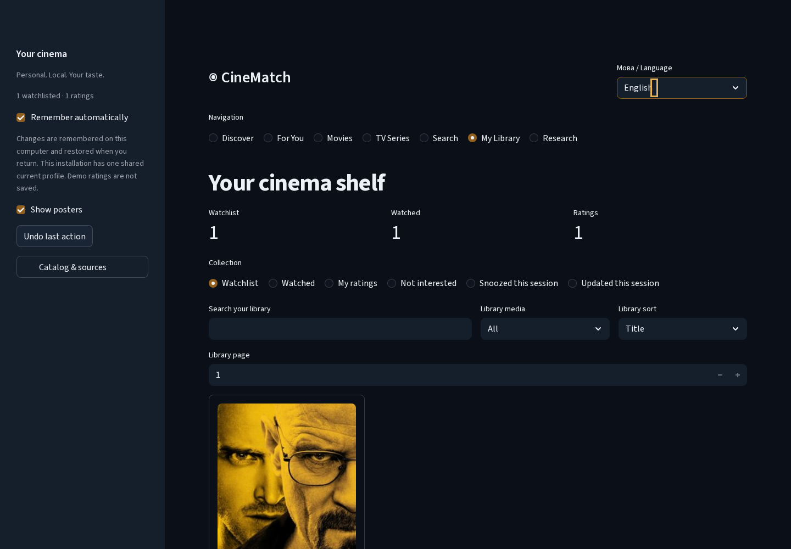

# CineMatch v1.3 — звіт для перевірки власником

Це **unreleased engineering milestone**, не опублікований Release. Усі зміни
доставлено залежними PR; `main` лишився на
`36d90f15cb874c4f7dd435d1d17b96221da3b83d`. Автоматичних merge, deployment,
тегів, облікових записів або cloud sync не було.

## 1. Початкова архітектура

Streamlit, SQLite/CAS, сім наявних алгоритмів, bounded runtime cache, MovieLens
aliases, TVmaze `-show_id`, profile schema 2–5 і v1.2 evidence checks були придатні
для повторного використання. Основні обмеження: історичний каталог, row-wise
literal search і виконання всіх UI-вкладок під час кожного rerun.
[Початковий план](v13-implementation.md) та [актуальна архітектура](architecture.md).

## 2. Реалізовані функції

Окремий сучасний metadata snapshot і namespace/mapping layer, validated API clients,
офлайн-кеш, native dark UI із сімома розділами, деталі назв, індексований пошук,
правдиві discovery collections, cold-title fallback, Undo і локальна бібліотека.
Новий default entry point працює також без MovieLens. Classic-інтерфейс лишився
явним compatibility mode; нові тести перевіряють справжній default UI.

## 3. Джерела й ліцензії

TVmaze: public API без ключа, CC BY-SA, attribution/source links та ShareAlike.
TMDB: необов’язковий developer read token, поточні некомерційні умови, approved
logo й точне required notice; комерційне використання потребує окремої ліцензії.
MovieLens лишається development/training data за умовами GroupLens.
Код MIT не перелiцензовує метадані, artwork або trademarks.
[Офіційні посилання й умови](catalog-providers.md).

## 4. Виміряне покриття

Публічна QA-інсталяція станом на 2026-10-10:

| Показник | Фактичний результат |
|---|---:|
| Канонічні історичні фільми | 10 123 |
| TVmaze-серіали | 973 |
| Загалом | 11 096 |
| Серіали з першою датою виходу від 2023 року | 32 |
| Серіали з першою датою в останні 730 днів | 27 |
| Реальні series synopses / poster links | 968 / 971 |
| Індивідуальні development rating events | 200 528 |
| Live TMDB movies / українські provider titles у цьому QA snapshot | 0 / 0 |

Використано п’ять TVmaze index pages, поточний web schedule і явний пошук
The Last of Us: сім live запитів на initial refresh. Деталі цієї назви окремо
отримано двома запитами: п’ять cast entries і десять crew entries з ролями.
Повторне offline читання деталей: **2 cache hits, 0 network requests**.
Попередня документація описувала 602 серіали іншого локального snapshot;
overlap з ним не виміряно, тому 973 не оголошуються 973 новими унікальними назвами.
Це частковий каталог. Без TMDB token live-покриття сучасних фільмів не перевірялося.

## 5. Пошук

Exact/partial/original/UK/EN назви, aliases, українська транслітерація,
mixed-language tokens, typo tolerance, короткі запити, accents і punctuation.
Явний рік розрізняє remakes; media/genres/year/source-rating filters і stable
sorting не зливають movie/series identities. Пошук не потребує embeddings або API.
[Алгоритм і критерії](discovery-search.md). У synthetic наборі 10 000 назв правильний
top-1 отримано в **6/6** відтворюваних кейсах; це sanity cases, не універсальна
оцінка recall або задоволеності користувачів.

## 6. UI/UX

Власна dark slate / amber палітра, native poster cards, responsive stacking,
видимий keyboard focus, сім navigation choices і лише одна активна сторінка
на rerun. До 12 карток, пагінація й cached index. Контраст configured
primary-button colors — 4,75:1; декоративний focus accent лишається світлішим.
Це не повна accessibility certification. Деталі містять лише доступні
джерельні поля, справжні rating scales, synopsis fallback і legal source/trailer
links. Перемикання мови зберігає canonical selections; translated widgets мають
мовні ключі, щоб native frontend не залишав старий selected-label.
CSS використовує власні public `st-key-*` classes; arbitrary provider HTML/JS
не ін’єктується. [UI, стан і rollback](product-ui.md).

## 7. Персоналізація

Original Adaptive і шість інших алгоритмів збережено. Відомі назви використовують
fixed original engine; modern-only назви — окремо пояснений signed genre affinity /
provider-quality heuristic, без вигаданих CF interactions або predictions.
«Популярні» означає історичні MovieLens vote counts; hidden gems мають явно
визначений поріг; «тому що сподобалося» залежить від реальної оцінки ≥4/5.
Немає «trending» із історичних голосів. Cold start не вимагає заповнення великої
форми; можна одразу відкривати каталог і поступово оцінювати знайомі історії.

## 8. Профілі й бібліотека

Старі JSON/формати 2–5 сумісні. Format 6 додається лише для сучасних IDs і зберігає
мінімальні provider references без credentials, ratings metadata або вигаданих
дат перегляду. Import validates staged references and the whole profile before
adoption. Немає destructive SQLite migration. Autosave/CAS, named profiles, JSON,
watchlist, explicit watched, stars, hide, session snooze та Undo працюють.
Undo відновлює попередні actual session activity records. Rated title не стає
unwatched без явного видалення оцінки. Перехід у деталі не позначає перегляд.

## 9. Продуктивність

Повні дані: [engineering_v13.json](../reports/engineering_v13.json).
Synthetic fixture: 1 500 items, 100 users, 2 400 events, 8 factors / 3 epochs,
20 recommendation repetitions, Linux/Python 3.11.16, NumPy 1.26.4, BLAS=1.
Cold AppTest — один sample; warm rerun — median із п’яти запусків.
Це engineering timings, **не Windows SLA або ML-quality result**.

Підсумкові точні synthetic значення записані в JSON; baseline warm rerun —
46,43 мс, v1.3 — 16,34 мс. Cold startup: 298,76 → 366,83 мс в одиничних
samples; виграшу в ньому не заявляємо. Adaptive/Hybrid — 1,52 / 2,35 мс,
RSS fixture — приблизно 170 MiB. Recommendation output SHA-256
залишився **9efaf4a62d7ab31c21cf4c93e386532074c645a5564012c3e849b1ef69929679**.

Actual public setup: fresh full-data engine/data load — 8,53 с без попередньо
підготовленого model artifact; facade build — **2 625,68 → 265,43 мс** після
indexed identity lookup, з exact mapping-equivalence tests. Index build —
950,91 мс один раз на revision; actual queries — median **8,26–16,08 мс**,
p95 **9,13–20,07 мс**. Один спостережений running-server RSS був приблизно
491 MiB, не гарантований peak. Synthetic search: legacy median 60–84 мс,
indexed 0,02–7,44 мс; index build 841,08 мс. Новий індекс додає build cost
і пам’ять, але не перебудовується на кожному query/rerun.

Browser timings включають UI/bootstrap/transport і записані окремо. Реальний
fresh-model старт повільніший за маленький cached-model synthetic fixture.
Вимірів Windows hardware, GPU або broad browser benchmark не проводилося.

## 10. Тести

**220 tests passed** локально, включно з двома opt-in pinned-weight CPU encoder
tests. Звичайний CI запускає 218 tests і пропускає ці два opt-in downloads.
14 наявних Matplotlib/Pyparsing deprecation warnings не є помилками.
Ruff, configured Mypy, усі pre-commit hooks і v1.2 evidence verifier пройшли.
Покрито namespaces/remakes/provenance, invalid API/429/offline/cache expiry,
UK/EN fallback/search ranking, watchlist/rating/Undo, atomic rejected imports,
missing posters, storage failure, revision invalidation і modern-only ranking.

Real Chromium **153.0.8010.12**, Playwright **1.63.0**, desktop 1440×1000 і mobile
390×844: first launch, Discover, search, details, watchlist, Undo, rating,
recommendations, library, language, reload/autosave restore і mobile navigation.
Також перевірено selected English labels, active navigation і відсутність
горизонтального overflow. Final run має 0 page errors / 0 failed requests.
Це справжній browser run; усі deliberate QA actions використовували окрему БД.

## 11. Безпека

Requirements audit: 101 dependencies, installed audit: 107; **0 known
vulnerabilities** на момент виконання. CI security audit і CodeQL успішні;
перевірки не вимикалися. Requests обмежені HTTPS hosts/endpoints, redirect
відхиляється, timeout=8 с, response≤4 MB, cache≤100 files/100 MB, fresh=6 год,
stale≤14 днів. Provider failures не показують exception body/token/URL.
Metadata snapshot≤5 000 identities/30 MB; original fetch dates збережено.
SQLite/CAS, JSON validation і localhost/CORS/XSRF safeguards лишилися.
У Git немає нових credentials, owner data або private DB.

Автоматична approval review відхилила зміну постійного user NSS trust store.
Host trust не змінено. Для QA створено disposable container з environment CA
лише у container-only NSS stores; TLS certificate checks не вимикалися.
`--no-sandbox` використано тільки для Chromium у disposable QA container,
не як production application setting. Повного security certification або
повної інвентаризації всіх repository alerts не заявляємо.

## 12. Справжні screenshots

Поточний застосунок, public data, isolated QA profile; не mockups і не owner history.




[For You](../assets/v13/desktop-for-you.png) ·
[Mobile Discover](../assets/v13/mobile-discover.png) ·
[Mobile details](../assets/v13/mobile-details.png).
Remote artwork лишається власністю джерел/rights holders. Native Streamlit
scrolling означає, що ці кадри показують фактичний viewport, а не змонтовану
штучно довгу сторінку.

## 13–14. PR і порядок інтеграції

| Порядок | PR | Обсяг | Base |
|---|---|---|---|
| 1 | [#16](https://github.com/Bandoof/CineMatch/pull/16) | Catalog/providers/offline facade | `main` |
| 2 | [#17](https://github.com/Bandoof/CineMatch/pull/17) | Indexed search/discovery | #16 branch |
| 3 | [#18](https://github.com/Bandoof/CineMatch/pull/18) | Cinematic UI/details/library | #17 branch |
| 4 | [#19](https://github.com/Bandoof/CineMatch/pull/19) | Product refinements/QA/docs | #18 branch |

Порядок: **#16 → #17 → #18 → #19**. Вони open і unmerged. Перед owner merge
перевірте актуальні checks кожного head. Після інтеграції попереднього PR
потрібно retarget наступний на `main`; особливо не використовуйте squash без
перевірки cumulative diffs. Історичні byte-preserved reports не нормалізуйте.

## 15–17. Обмеження, залишкові дії й v1.4

Поточні обмеження: partial catalog, zero live TMDB QA без token, TVmaze без
українських назв у перевіреному snapshot, потреба інтернету для artwork,
session-only snooze/Undo/activity, no universal search-quality or accessibility
certification, no live Windows/GPU measurements. Cached dates не гарантують
current release availability. Classic/older binaries не читають schema 6.

Для власника: review/integrate PR chain; за бажанням перевірити TMDB зі своїм
token і конкретними UK/movie feeds; зробити manual Windows usability та
screen-reader перевірку. Це не незавершені заглушки замість реалізованих функцій.
Публічний deployment вимагатиме окремо авторизованої auth/privacy/threat-model роботи.

Для v1.4: перевірене локалізоване movie coverage, користувацькі search/usability
кейси й **новий ще не використаний** research test cohort із frozen protocol.
Історичні +17,8% лишаються **не підтвердженими**; 326-user final cohort уже
consumed, v3 overlap=199 disclosed. Усі surviving evidence hashes збережено;
holdout не запускався і production ranking policy не змінювалася.

## Reproduce engineering QA / Відтворення

```bash
python -m pip install -r requirements-dev.txt
python -m pytest -q
python -m ruff check .
python -m mypy
pre-commit run --all-files
python -m scripts.verify_v12_evidence
python -m pip_audit -r requirements-research.txt
OPENBLAS_NUM_THREADS=1 python -m scripts.benchmark_discovery --output search-local.json
OPENBLAS_NUM_THREADS=1 python -m scripts.benchmark_performance --output performance-local.json
```

Browser QA is optional: install `playwright==1.63.0`, run `playwright install chromium`,
prepare the public dataset/catalog including The Last of Us and Breaking Bad,
refresh The Last of Us details once to save real cast/crew, and start the app with
an **isolated** `CINEMATCH_PROFILE_DB`, empty QA library and Ukrainian language.
Then: `python -m scripts.verify_product_browser --isolated-profile --output qa-screenshots`.
Default URL is `http://127.0.0.1:8513`; use `--url` for another local port.
This command intentionally creates QA library actions; never point it at owner data.
The observed managed environment needed its existing proxy CA inside the disposable
browser container. Do not change global trust or disable TLS to reproduce it.
