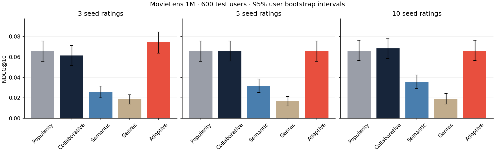

# Independent MovieLens 1M experiment

Generated: 2026-10-09T09:01:09.182777+00:00. Protocol 3. 1,000,209 events / 6,040 source users / 3,883 canonical films.

Validation: 300 users. Test: 600 users. User overlap across distinct time boundaries: 199.

Weights selected on validation only. Values below are untouched test results.



| Seed ratings | ALS | LSA | Community quality |
|---|---:|---:|---:|
| 3 | 25% | 25% | 50% |
| 5 | 0% | 0% | 100% |
| 10 | 0% | 0% | 100% |

## After 3 seed ratings

| Model | Precision@10 | Recall@10 | NDCG@10 | Coverage | Diversity | Novelty (bits) |
|---|---:|---:|---:|---:|---:|---:|
| Popularity | 0.0638 | 0.0215 | 0.0657 | 0.0031 | 0.8416 | 9.6053 |
| Collaborative | 0.0620 | 0.0205 | 0.0614 | 0.0209 | 0.7838 | 9.9325 |
| Semantic | 0.0242 | 0.0063 | 0.0258 | 0.5473 | 0.3661 | 12.4794 |
| Genres | 0.0173 | 0.0039 | 0.0186 | 0.2423 | 0.1612 | 12.7025 |
| Adaptive | 0.0697 | 0.0232 | 0.0744 | 0.0337 | 0.6956 | 9.6731 |

Paired Adaptive − Popularity NDCG@10 95% interval: [+0.0031, +0.0144]. Positive improvement in this cohort.

## After 5 seed ratings

| Model | Precision@10 | Recall@10 | NDCG@10 | Coverage | Diversity | Novelty (bits) |
|---|---:|---:|---:|---:|---:|---:|
| Popularity | 0.0638 | 0.0215 | 0.0657 | 0.0033 | 0.8420 | 9.6053 |
| Collaborative | 0.0655 | 0.0217 | 0.0659 | 0.0255 | 0.7730 | 9.9565 |
| Semantic | 0.0278 | 0.0069 | 0.0317 | 0.5473 | 0.3481 | 12.3834 |
| Genres | 0.0157 | 0.0025 | 0.0167 | 0.2421 | 0.1146 | 12.9520 |
| Adaptive | 0.0638 | 0.0215 | 0.0657 | 0.0033 | 0.8420 | 9.6053 |

Paired Adaptive − Popularity NDCG@10 95% interval: [+0.0000, +0.0000]. No established improvement over popularity.

## After 10 seed ratings

| Model | Precision@10 | Recall@10 | NDCG@10 | Coverage | Diversity | Novelty (bits) |
|---|---:|---:|---:|---:|---:|---:|
| Popularity | 0.0645 | 0.0217 | 0.0663 | 0.0036 | 0.8431 | 9.6061 |
| Collaborative | 0.0667 | 0.0204 | 0.0684 | 0.0371 | 0.7555 | 9.9593 |
| Semantic | 0.0335 | 0.0084 | 0.0359 | 0.4744 | 0.3590 | 12.3403 |
| Genres | 0.0177 | 0.0042 | 0.0187 | 0.2470 | 0.0782 | 12.9737 |
| Adaptive | 0.0645 | 0.0217 | 0.0663 | 0.0036 | 0.8431 | 9.6061 |

Paired Adaptive − Popularity NDCG@10 95% interval: [+0.0000, +0.0000]. No established improvement over popularity.

## Scope

Simulated new users; entire target histories removed from background training. Last N pre-boundary ratings are seeds. Full catalog candidates exclude seeds; positives exclude all earlier history. 300 validation / max 600 test users selected by fixed ID hash. Current Wikipedia/TVmaze metadata is retrospective; not an as-of historical metadata guarantee. Series/negative-feedback/live satisfaction not measured. Mixing policy transfers to the separate expanded app; deployment quality must be checked independently.

These are separate 1M experiment numbers. The application transfers the mixing policy to another catalog; these are not application/series accuracy claims. Novelty is not accuracy. Confidence intervals do not cover deployment shift.

## Reproduce

```bash
python -m scripts.download_content
python -m scripts.download_benchmark
python -m scripts.benchmark_v3
python -m scripts.report_v3
```

MovieLens ZIP SHA-256: `a6898adb50b9ca05aa231689da44c217cb524e7ebd39d264c56e2832f2c54e20`.

Content snapshot SHA-256: `903ac59408daa2fb4e9563fc178f25cc507785860e51456b15c2ff5ff0e54fec`.

[Model card](../docs/ml-v3-model-card.md) · [JSON](ml_v3.json) · [CSV](ml_v3.csv) · [Official dataset](https://grouplens.org/datasets/movielens/1m/)
